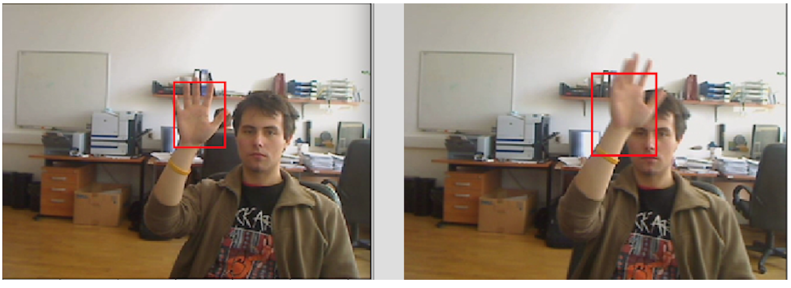

# Real-Time-Object-Tracking

Object Tracking has been the target of research for a long time due to its wide range of applications and challenges (like occlusion, change in contrast, video quality, etc). Here, we seek to qualitatively and quantitatively compare two methods famously used in computer vision: [Kalman Filter](http://www.bzarg.com/p/how-a-kalman-filter-works-in-pictures/) along with [Hungarian Algorithm](https://www.topcoder.com/community/data-science/data-science-tutorials/assignment-problem-and-hungarian-algorithm/) and [Siamese network](https://www.cs.cmu.edu/~rsalakhu/papers/oneshot1.pdf). Since, Siamese is known to perform only on a single target object, we are performing the comparison only on a single object. Nonetheless, we have also attached the code for [multile objects too ](https://github.com/AKASHKADEL/Real-Time-Object-Tracking/tree/master/multi%20object%20tracking). The data we are using is from the [VOT dataset](http://www.votchallenge.net/vot2016/dataset.html).

Among the two, Siamese network performed very well with a higher value of [Intersection Over Union](https://www.pyimagesearch.com/2016/11/07/intersection-over-union-iou-for-object-detection/) metric. Some of the results are below:

  
  

  
  

